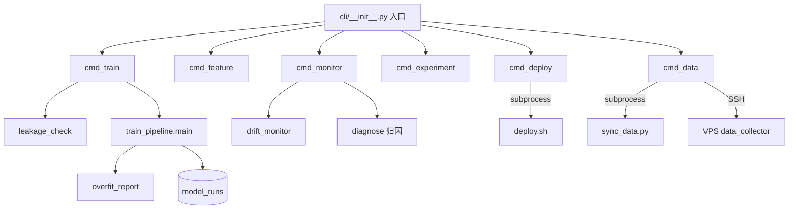

# feat: BTC ML 模型迭代 CLI 平台

## Overview

为 BTC 5 分钟预测器构建统一 CLI 编排层（`btc` 命令），将 20+ 分散脚本组合为标准化迭代工作流。核心变更：CLI 入口 + `model_runs` 表扩展 + `train_pipeline.py` 参数化 + 训练质量守护 + 漂移监控 + 线上归因。

## Problem Frame

现有能力完整但碎片化。每次迭代需手动串联多个脚本，实验元数据散落文件系统，新特征路径碎片化，实盘数据无法自动闭环。详见 (see origin: docs/brainstorms/2026-03-31-ml-iteration-platform-requirements.md)

## Requirements Trace

| ID | 需求 | 实现单元 |
|----|------|----------|
| R1 | CLI 入口 + argparse | Unit 1 |
| R2 | model_runs 表扩展 | Unit 1 |
| R3 | experiment list | Unit 3 |
| R4 | experiment compare | Unit 3 |
| R5 | data status | Unit 2 |
| R6 | data fetch | Unit 2 |
| R7 | train_pipeline 参数化 | Unit 4 |
| R8 | feature_metadata 增强 | Unit 5 |
| R9 | feature validate | Unit 5 |
| R10 | feature explore | Unit 5 |
| R11 | features-include/exclude | Unit 4 |
| R12 | 训练后自动写入 | Unit 4 |
| R13 | 实验血缘 | Unit 4 |
| R14 | 自动对比摘要 | Unit 4 |
| R15a | SHAP explain | Unit 7 |
| R15b | 市场状态切片 | Unit 7 |
| R15c | 线上归因三层钻取 | Unit 7 |
| R16 | 输入输出分布监控 | Unit 6 |
| R17 | retrain-check | Unit 6 |
| R18 | deploy promote | Unit 8 |
| R19 | deploy shadow | Unit 8 |
| R20 | deploy compare | Unit 8 |
| R21 | data sync | Unit 2 |
| R22 | 数据闭环说明（架构声明，非实现项） | — |
| R25 | 信息穿越检测 | Unit 4 |
| R26 | 过拟合监控 | Unit 4 |
| R27 | loss/eval 可配置 | Unit 4 |
| R28 | 数据采集全覆盖 | Unit 2 |
| R29 | data health | Unit 2 |
| R30 | data validate | Unit 2 |

## Scope Boundaries

- 不做 Web UI，不做多用户，不做自动重训练，不做多策略泛化 (see origin)
- 会改 `train_pipeline.py` 的 `main()` 签名和返回值，但不改训练逻辑
- `deploy.sh` 保留原有功能，CLI 通过 subprocess 调用它

## Context & Research

### Relevant Code and Patterns

**现有接口签名（CLI 需包装的核心函数）**：

| 函数 | 当前签名 | 需改动 |
|------|---------|--------|
| `train_pipeline.main()` | `-> str` (返回 run_id) | 需改为接受 kwargs，返回 `dict` |
| `db.insert_model_run(run, run_id)` | `-> str` | 需适配新字段 |
| `build_features(df_1m, ...)` | `-> DataFrame` | 不改，CLI 在下游过滤列 |
| `experiment_compare.main()` | bare `main()` | 需提取为可调用函数 |
| `explore_features.main()` | bare `main()` | 需提取为可调用函数 |
| `diagnose_features.main()` | bare `main()` | 需提取为可调用函数 |
| `sync_data.py` | `{pull\|status} [--full]` | 直接 subprocess 调用 |
| `data_collector.py` | `--backfill --status` | VPS 上运行，SSH 调用 |
| `deploy.sh` | `{deploy\|sync-model\|...}` | subprocess 调用 |

**DuckDB 模式**：所有模块使用 `db.get_connection()` + try/finally close，写锁有 5 次指数退避重试。

**模块调用约定**：`uv run python -m training.<module>` 或 `uv run python service/<script>.py`。

**Challenger 机制**：`config.py:CHALLENGER_MODELS` 列表 + `live_monitor._run_challengers()` 在主 tick 循环内执行 shadow 预测，写入 `live_predictions` 表 `is_challenger=True`。

### Institutional Learnings

- **PurgedTimeSeriesSplit 不可商量**：高频数据有强自相关，禁止 sklearn KFold/shuffle。任何训练代码重构必须保留 `purge_gap=12`
- **MODEL_CARD.md 必须自动生成**：训练完成后自动产出，不依赖 CLI 层触发
- **VPS 路径差异**：本地 `models/` → VPS `/opt/btc-5m-predictor/models/`，deploy 命令需正确翻译路径

## Key Technical Decisions

### 规划阶段解决的 Deferred Questions

| 问题 | 决策 | 理由 |
|------|------|------|
| R7: main() 重构范围 | 所有训练参数通过 kwargs 传入，默认值从 config/train_config 读取，CLI 传入覆盖 | 保持直接调用 `main()` 时的行为不变 |
| R2: model_runs 扩展方案 | ALTER TABLE ADD COLUMN（DuckDB 原生支持），不新建表 | 非破坏性，现有数据保留，新字段 DEFAULT NULL |
| R8: FEATURE_META 衔接 | 训练时在 `build_features()` 返回后、feature selection 前，用 metadata 过滤列。不改 `build_features()` 本身 | 最小侵入，metadata 作为可选过滤层而非硬门控 |
| R16: 漂移滚动窗口 | 按预测数量（默认 200 条，约 3-4 天量），而非按天 | 预测频率不均匀（非交易时段少），按数量更稳定 |
| R25: 穿越检测范围 | 训练前静态检查（purge gap 断言 + 特征覆盖天数 vs 数据范围检查）。窗口边界值检测 defer 到 feature validate 命令 | 静态检查可拦截 90% 常见穿越，运行时检测成本高且属于特征级诊断 |
| R27: CatBoost loss/eval | 默认 Logloss + AUC。支持列表：loss={Logloss, CrossEntropy}，eval={AUC, F1, Accuracy, BalancedAccuracy} | CatBoost 原生支持的二分类组合，Focal Loss 需自定义不纳入 V1 |
| R16: PSI 分箱策略 | 训练期十分位数分箱（固定 reference bins） | 分位数分箱对偏态分布更鲁棒，训练期分布作为稳定参考 |

### 架构决策

- **CLI 框架**：`argparse` + 子命令分发，入口在 `cli/__init__.py` 的 `main()` 中（注意：`cli.py` 文件和 `cli/` 目录不能同时存在，否则 Python 模块解析冲突。必须使用包模式 `cli/__init__.py`，不创建独立 `cli.py`）
- **CLI 注册**：在 `pyproject.toml` 的 `[project.scripts]` 中注册 `btc = "cli:main"`，使 `uv run btc` 可用
- **`insert_model_run()` 改为命名列 INSERT**：当前使用 22 个位置 `?` 占位符，ALTER TABLE 后新列不会被写入。必须改为 `INSERT INTO model_runs (col1, col2, ...) VALUES (?, ?, ...)`，只写入 dict 中存在的键，未传字段取 DEFAULT NULL
- **`training/pipeline.py` 处置**：现有 `pipeline.py` 是一个原始编排器（fetch → train → dashboard），其功能将被 `btc train` 取代。`main()` 返回类型从 `str` 改为 `dict` 后，`pipeline.py:42` 的 `run_id = train_pipeline.main()` 会崩溃。策略：在 Unit 4 中适配 `pipeline.py` 为 `result = train_pipeline.main(); run_id = result["run_id"]`，后续废弃
- **`train_pipeline.py` 公共导出符号保护**：5 个下游模块 import 了 `PurgedTimeSeriesSplit`、`FUTURES_PREFIXES`、`FEATURE_CATEGORIES`、`select_features`、`select_features_by_category`、`categorize_features`、`split_feature_cols`、`comprehensive_evaluation`、`_run_backtest_report`、`_save_feature_manifest`、`_lgb_importance`。重构 `main()` 时这些符号的位置和签名必须保持不变
- **`register_challenger.py` 统一**：现有 `register_challenger.py` 通过 DB 管理 challenger，而 `config.py:CHALLENGER_MODELS` 是另一套。`btc deploy shadow` 将沿用 `register_challenger.py` 的逻辑（操作 DB），并同步更新 `config.py` 以保持一致。`register_challenger.py` 的核心逻辑提取为可调用函数
- **`config.py` 原子写入**：所有对 `config.py` 的写操作（promote/shadow）使用 `tempfile.NamedTemporaryFile` + `os.replace()` 模式，消除半写风险
- **subprocess vs import**：训练/特征等 Python 模块通过 import 调用；`deploy.sh` 和 VPS SSH 操作通过 subprocess
- **输出格式**：所有 CLI 输出为结构化 Markdown 表格或 JSON（`--json` flag），Claude Code 友好
- **失败处理**：底层脚本失败时，写入 `model_runs` 标记 `status=FAILED`，CLI 返回非零退出码

## Open Questions

### Resolved During Planning

见上方 "规划阶段解决的 Deferred Questions" 表格。

### Deferred to Implementation

- `experiment_compare.py` 的 `main()` 重构为可调用函数时，需确认其内部是否有全局状态副作用
- `data_collector.py` 在 VPS 上的 `--status` 输出格式是否足够结构化供 `btc data health` 解析，可能需要增加 `--json` 输出
- PSI 计算时训练期分布参考数据存入 `models/{version}/reference_distribution.json`（已在 Unit 4 确认）
- `btc train --tags "tag1,tag2"` 的 tags 如何在 `btc experiment list` 中使用（建议支持 `--tags` 筛选）
- Unit 4 和 Unit 5 的特征过滤交互：Unit 4 在 `build_features()` 返回后通过列过滤实现 `--features-include/exclude`；Unit 5 的 metadata 增强提供类别名映射供 Unit 4 使用。两者是 soft filter（不改 `build_features()` 本身）

## High-Level Technical Design

> *This illustrates the intended approach and is directional guidance for review, not implementation specification. The implementing agent should treat it as context, not code to reproduce.*

```
项目结构增量：

btc_5m_predictor/
├── cli/                      # CLI 包（入口 + 子命令）
│   ├── __init__.py           # CLI 入口 main() + argparse 分发
│   ├── cmd_data.py           # data status/fetch/sync/health/validate
│   ├── cmd_feature.py        # feature validate/explore
│   ├── cmd_train.py          # train (封装 train_pipeline)
│   ├── cmd_experiment.py     # experiment list/compare
│   ├── cmd_deploy.py         # deploy promote/shadow/compare
│   └── cmd_monitor.py        # monitor drift/diagnose/retrain-check
├── training/
│   ├── train_pipeline.py     # [修改] main() 参数化
│   ├── leakage_check.py      # [新建] 训练前穿越检测
│   ├── overfit_report.py     # [新建] 过拟合诊断
│   └── drift_monitor.py      # [新建] PSI + 概率分布 + 准确率监控
├── data/
│   └── feature_metadata.py   # [修改] 补充 source_dep, min_days
└── db.py                     # [修改] model_runs ALTER TABLE
```



## Implementation Units

### Phase 1: Foundation

- [x] **Unit 1: CLI 骨架 + model_runs 表扩展**

**Goal:** 建立 CLI 入口和子命令分发框架，扩展 DuckDB schema 支持新字段

**Requirements:** R1, R2

**Dependencies:** None

**Files:**
- Create: `cli/__init__.py` (入口 main()), `cli/cmd_data.py` (stub), `cli/cmd_feature.py` (stub), `cli/cmd_train.py` (stub), `cli/cmd_experiment.py` (stub), `cli/cmd_deploy.py` (stub), `cli/cmd_monitor.py` (stub)
- Modify: `db.py` (ALTER TABLE + insert_model_run 适配), `pyproject.toml` ([project.scripts])
- Test: `tests/test_cli_skeleton.py`, `tests/test_db_migration.py`

**Approach:**
- `cli/__init__.py` 使用 argparse 的 `add_subparsers()` 建立六个子命令组，每组再有子命令（不创建独立 `cli.py` 文件）
- `db.py` 在 `init_db()` 中增加 ALTER TABLE 语句添加新列：`feature_set JSON`、`parent_run_id VARCHAR`、`tags VARCHAR`、`loss_function VARCHAR`、`eval_metric VARCHAR`、`train_auc DOUBLE`、`overfit_train_cv_gap DOUBLE`、`overfit_cv_ho_gap DOUBLE`、`cv_fold_std DOUBLE`。DuckDB 的 ALTER TABLE ADD COLUMN IF NOT EXISTS 对已有行自动填 NULL
- `insert_model_run()` 改为命名列 INSERT：构建 `INSERT INTO model_runs ({columns}) VALUES ({placeholders})`，只写入 `run` dict 中存在的键。这确保新旧调用方都能正常工作
- `pyproject.toml` 添加 `[project.scripts] btc = "cli:main"` 使 `uv run btc` 可用

**Patterns to follow:**
- `deploy.sh` 的 case/esac 分发模式（Python argparse 等价）
- `db.py:init_db()` 的 CREATE TABLE IF NOT EXISTS 模式
- 现有脚本的 `argparse` 用法（`experiment_compare.py`、`simulate_live.py`）

**Test scenarios:**
- Happy path: `btc --help` 输出六个子命令组
- Happy path: `btc data --help` 输出 data 下的子命令
- Happy path: 对已有 model_runs 数据的 DB 执行 init_db()，新列被添加，旧数据不受影响
- Edge case: 重复执行 init_db()（ALTER TABLE ADD COLUMN IF NOT EXISTS）不报错
- Happy path: `insert_model_run()` 传入含新字段的 dict 正确写入
- Happy path: `insert_model_run()` 传入不含新字段的 dict（向后兼容）正确写入，新字段为 NULL

**Verification:**
- `uv run btc --help` 显示完整子命令树
- DuckDB 中 `DESCRIBE model_runs` 包含所有新列
- 旧数据查询不受影响

---

- [x] **Unit 2: Data 命令（status/fetch/sync/health/validate）**

**Goal:** 统一数据管理 CLI，覆盖本地数据状态、远程采集、同步、健康检查、完整性验证

**Requirements:** R5, R6, R21, R22, R28, R29, R30

**Dependencies:** Unit 1

**Files:**
- Modify: `cli/cmd_data.py`
- Test: `tests/test_cmd_data.py`

**Approach:**
- `btc data status`: 查询 DuckDB 各表的 MIN/MAX timestamp + count，格式化为 Markdown 表格输出
- `btc data fetch --source <name> [--days N]`: 维护 source name → fetch 脚本的映射 dict，通过 import 调用对应模块的 main/fetch 函数。支持的 source: `klines_1m`, `klines_30m`, `klines_4h`, `futures`, `coinbase`, `eth`, `all`
- `btc data sync [--full]`: subprocess 调用 `uv run python service/sync_data.py pull [--full]`，输出同步结果
- `btc data health`: SSH 到 VPS 执行 `cd /opt/btc-5m-predictor && uv run python service/data_collector.py --status`，解析输出检查各源最后采集时间，超过 1 小时标记 ALERT
- `btc data validate`: 同步后对本地 DuckDB 执行三项检查：(a) 时间连续性 — 按 5 分钟粒度检查间隔 > 10 分钟的缺口，(b) 值域合理性 — BTC 价格在 [1000, 500000] 范围，成交量非负，(c) 时间对齐 — klines 与 futures 表的时间戳匹配度 > 95%

**Patterns to follow:**
- `sync_data.py` 的 `pull/status` 子命令模式
- `data_collector.py --status` 的输出格式
- `db.py` 的 `get_connection()` + try/finally 模式

**Test scenarios:**
- Happy path: `btc data status` 输出包含所有数据源的覆盖范围表格
- Happy path: `btc data fetch --source futures --days 7` 调用正确的 fetch 函数
- Happy path: `btc data fetch --source all` 依次调用所有 fetch 函数
- Error path: `btc data fetch --source unknown_source` 输出错误提示和可用 source 列表
- Happy path: `btc data validate` 对完整数据集输出 PASS
- Edge case: `btc data validate` 检测到 30 分钟缺口时输出 WARNING + 缺口区间
- Edge case: `btc data validate` 检测到异常价格（如 0 或负值）时输出 ALERT
- Error path: `btc data health` 在 VPS 不可达时输出连接错误而非 crash

**Verification:**
- 所有 data 子命令可执行并输出结构化文本
- `data validate` 对当前数据集运行无 ALERT

---

- [x] **Unit 3: Experiment 命令（list/compare）**

**Goal:** 提供实验查询和对比的 CLI 接口

**Requirements:** R3, R4

**Dependencies:** Unit 1

**Files:**
- Modify: `cli/cmd_experiment.py`, `training/experiment_compare.py` (提取可调用接口)
- Test: `tests/test_cmd_experiment.py`

**Approach:**
- `btc experiment list [--sort-by <metric>] [--top N] [--status completed]`: 查询 `model_runs` 表，输出 Markdown 表格，列包含 run_id、created_at、n_features、cv_mean_auc、bt_sharpe、bt_win_rate、bt_total_pnl、status、tags
- `btc experiment compare <id1> <id2>`: 重构 `experiment_compare.py` 的核心逻辑为 `compare_runs(id1, id2) -> dict`，输出：指标 diff 表格、特征集 diff（新增/移除/共有）、超参 diff、过拟合指标对比
- 所有输出默认 Markdown 表格，支持 `--json` flag

**Patterns to follow:**
- `experiment_compare.py` 的现有对比逻辑（`--stage` 参数控制对比深度）
- `model_arena.py` 的多模型评分逻辑

**Test scenarios:**
- Happy path: `btc experiment list` 输出包含已有实验的 Markdown 表格
- Happy path: `btc experiment list --sort-by bt_sharpe --top 5` 返回按 Sharpe 降序的前 5 条
- Happy path: `btc experiment compare <id1> <id2>` 输出两个实验的指标/特征/超参 diff
- Edge case: `btc experiment list` 在无实验记录时输出空表格提示
- Error path: `btc experiment compare` 传入不存在的 run_id 时输出明确错误
- Happy path: `--json` flag 输出有效 JSON

**Verification:**
- 对现有 model_runs 数据执行 list 和 compare 命令，输出正确且可读

---

### Phase 2: Training Core

- [x] **Unit 4: train_pipeline 参数化 + 训练质量守护**

**Goal:** 重构 `main()` 接受外部参数，集成穿越检测、过拟合监控、loss/eval 可配置、自动对比

**Requirements:** R7, R11, R12, R13, R14, R25, R26, R27

**Dependencies:** Unit 1 (model_runs 新字段), Unit 3 (compare 逻辑复用)

**Files:**
- Modify: `training/train_pipeline.py` (main 签名 + 返回值 + 质量守护集成 + 保存 reference_distribution.json)
- Modify: `training/pipeline.py` (适配 main() 返回 dict)
- Create: `training/leakage_check.py`, `training/overfit_report.py`
- Modify: `cli/cmd_train.py`
- Test: `tests/test_train_pipeline.py`, `tests/test_leakage_check.py`, `tests/test_overfit_report.py`

**Approach:**

*main() 重构*：
```
main() 当前签名: def main() -> str
目标签名: def main(
    sample_start=None, sample_end=None,
    label_threshold=None,
    features_include=None, features_exclude=None,
    loss_function='Logloss', eval_metric='AUC',
    parent_run_id=None, tags=None,
) -> dict  # {run_id, cv_auc, ho_auc, bt_sharpe, ...}
```
所有参数有默认值（从 config/train_config 读取），CLI 传入覆盖。返回值改为包含所有关键指标的 dict。

*features_include/exclude*：在 `build_features()` 返回后、`select_features()` 前，根据参数过滤列。支持特征名和类别名（类别名从 `FEATURE_META` 的 category 字段匹配）。

*穿越检测 (leakage_check.py)*：训练前执行三项静态检查：
- (a) 断言 purge_gap >= 配置值（12）
- (b) 检查特征列的 source_dep（从 FEATURE_META）要求的最小天数 <= 实际数据范围
- (c) 验证 label 计算使用的 close 时间戳在 window_end 之后
- 检查失败则 raise LeakageError，CLI 捕获后输出报告并退出

*过拟合监控 (overfit_report.py)*：训练后计算并返回：
- Train AUC vs CV AUC gap（> 0.05 标记 WARNING）
- CV AUC vs Holdout AUC gap（> 0.04 标记 WARNING）
- 各折 AUC 标准差（> 0.03 标记 WARNING）
- 结果写入 model_runs 的 overfit_* 字段
- 在 MODEL_CARD.md 的 "Overfitting Analysis" 部分显著标注

*loss/eval 可配置*：传入 CatBoost 的 `loss_function` 和 `eval_metric` 参数。记录到 model_runs。

*自动对比 (R13/R14)*：训练完成后，从 model_runs 查找 parent_run_id 或最近一条 status=completed 的记录，调用 compare 逻辑输出 delta 摘要。

*参考分布保存*：训练完成后，为每个选中特征计算十分位数 bin 边界，保存到 `models/{version}/reference_distribution.json`。此文件供 Unit 6 的 PSI 计算使用。格式：`{feature_name: [q10, q20, ..., q90]}`。

*pipeline.py 适配*：将 `pipeline.py:42` 从 `run_id = train_pipeline.main()` 改为 `result = train_pipeline.main(); run_id = result["run_id"]`。

*公共导出符号保护*：重构过程中以下符号的位置和签名不可变：`PurgedTimeSeriesSplit`, `FUTURES_PREFIXES`, `FEATURE_CATEGORIES`, `select_features`, `select_features_by_category`, `categorize_features`, `split_feature_cols`, `comprehensive_evaluation`, `_run_backtest_report`, `_save_feature_manifest`, `_lgb_importance`。

*PurgedTimeSeriesSplit 保护*：训练代码重构过程中必须保留 `purge_gap=12`，增加断言 `assert isinstance(cv_splitter, PurgedTimeSeriesSplit)`。

**Patterns to follow:**
- 现有 `main()` 的训练流程（8 个阶段顺序不变）
- `insert_model_run()` 的 dict 构建模式
- `diagnose_features.py` 的诊断报告输出格式

**Test scenarios:**
- Happy path: `btc train` 无额外参数时行为与当前 `main()` 完全一致（默认值回退测试）
- Happy path: `btc train --sample-start 2026-03-01 --sample-end 2026-03-29` 正确限制数据范围
- Happy path: `btc train --features-include ta_trend,ta_momentum` 只保留这两个类别的特征
- Happy path: `btc train --loss-function CrossEntropy --eval-metric AUC` 正确传入 CatBoost
- Happy path: `btc train --parent <run_id>` 训练后自动与父实验对比并输出 delta
- Happy path: 训练完成后 model_runs 中 feature_set、loss_function、eval_metric、overfit_* 字段有值
- Edge case: `--features-include unknown_category` 输出警告并列出可用类别名
- Error path: leakage_check 检测到 purge_gap < 12 时中止训练并输出具体问题
- Happy path: overfit_report 在 Train-CV gap > 0.05 时在输出中标记 WARNING
- Integration: 完整训练 → model_runs 写入 → MODEL_CARD.md 生成 → 自动对比摘要，端到端验证

**Verification:**
- 完整训练流程通过，model_runs 新字段有值
- MODEL_CARD.md 包含 "Overfitting Analysis" 部分
- `btc experiment compare` 能正确读取新字段

---

- [x] **Unit 5: Feature 命令（metadata 增强 + validate/explore）**

**Goal:** 增强特征元数据，提供特征验证和探索 CLI

**Requirements:** R8, R9, R10

**Dependencies:** Unit 1

**Files:**
- Modify: `data/feature_metadata.py` (补充字段), `cli/cmd_feature.py`
- Test: `tests/test_cmd_feature.py`

**Approach:**
- `FEATURE_META` 每条增加 `source_dep`（数据源名，如 `'klines_1m'`, `'futures_oi'`）和 `min_days`（最小覆盖天数，如 `150` 或 `30`）。对已有 120 条记录批量补充
- `btc feature validate <name>`: 对指定特征计算 — 分布统计（mean/std/missing%/outlier%）、与标签的单变量 AUC（用 Purged CV）、窗口边界值变化检测（取样 100 个窗口，比较 t-1 和 t 时刻的特征值变化率）
- `btc feature explore [--category <cat>]`: 封装 `explore_features.py`，批量输出所有（或指定类别）特征的质量报告
- 输出为 Markdown 表格，每行一个特征，列包含统计指标和质量标记

**Patterns to follow:**
- `diagnose_features.py` 的诊断逻辑
- `explore_features.py` 的批量分析模式
- `FEATURE_META` 现有 dict 结构

**Test scenarios:**
- Happy path: `btc feature validate taker_vol_raw` 输出该特征的分布统计 + 单变量 AUC + 质量评级
- Happy path: `btc feature explore --category volume` 输出成交量类特征的批量报告
- Edge case: `btc feature validate nonexistent_feature` 输出 "特征未注册" 提示
- Happy path: FEATURE_META 中所有条目包含 source_dep 和 min_days 字段
- Integration: `btc feature validate` 的输出质量标记（GOOD/WARNING/ALERT）与 `btc train --features-include` 联动 — 被标记 ALERT 的特征在训练时输出警告

**Verification:**
- `FEATURE_META` 所有 120 条记录有 source_dep 和 min_days
- validate 和 explore 命令输出结构化 Markdown

---

### Phase 3: Monitoring & Attribution

- [x] **Unit 6: 漂移检测 + 分布监控**

**Goal:** 实现输入特征/输出概率的分布监控和漂移检测

**Requirements:** R16, R17

**Dependencies:** Unit 1 (model_runs), Unit 2 (data sync)

**Files:**
- Create: `training/drift_monitor.py`
- Modify: `cli/cmd_monitor.py`
- Test: `tests/test_drift_monitor.py`

**Approach:**

*drift_monitor.py 核心逻辑*：
- **训练期参考分布**：训练时保存每个特征的十分位数 bin 边界到 `models/{version}/reference_distribution.json`（Unit 4 训练流程中增加此步骤）
- **特征 PSI 计算**：对每个活跃特征，将实盘窗口值按训练期 bin 分箱，计算 PSI = Σ(actual% - expected%) × ln(actual%/expected%)。PSI > 0.2 → DRIFT，0.1-0.2 → SHIFT，< 0.1 → STABLE
- **概率分布监控**：对比实盘预测概率 vs CV 期 OOF 概率 — KS 检验 p-value、均值偏移、方差比
- **准确率指标**：滚动 200 条的 AUC、胜率、校准偏移（mean predicted prob vs actual win rate）
- 连续 3 天 AUC < 95% CV AUC → ALERT

*btc monitor drift*：从 VPS 同步最新 live_predictions（若未同步则提示先执行 `btc data sync`），计算上述指标，输出分层漂移报告（Markdown 表格）

*btc monitor retrain-check*：汇总 drift 状态 + 新数据量（自上次训练后新增条数）+ 上次训练时间，输出建议（RETRAIN_RECOMMENDED / STABLE / MONITORING）

**Patterns to follow:**
- `service/live_monitor.py` 的滚动统计计算
- `training/robustness_check.py` 的指标计算模式

**Test scenarios:**
- Happy path: 对稳定分布数据计算 PSI < 0.1，输出 STABLE
- Happy path: 对人工漂移数据（均值偏移 2σ）计算 PSI > 0.2，输出 DRIFT
- Happy path: `btc monitor drift` 输出包含特征 PSI 表格 + 概率分布报告 + 准确率趋势
- Edge case: 实盘数据不足 200 条时，使用全部可用数据并标注 "样本不足，结论谨慎"
- Edge case: 某特征在实盘中全为缺失值时标记 MISSING 而非计算 PSI
- Happy path: `btc monitor retrain-check` 在 AUC 持续低于阈值时输出 RETRAIN_RECOMMENDED + 原因
- Happy path: `btc monitor retrain-check` 在指标正常时输出 STABLE

**Verification:**
- 对当前实盘数据运行 drift 命令输出合理报告
- retrain-check 输出包含明确建议和支撑数据

---

- [x] **Unit 7: 归因分析 + SHAP 解释**

**Goal:** 实现 SHAP 特征解释、市场状态切片、线上三层归因

**Requirements:** R15a, R15b, R15c

**Dependencies:** Unit 1, Unit 6 (drift_monitor 的 PSI 计算复用)

**Files:**
- Create: `training/explain.py`
- Modify: `cli/cmd_monitor.py` (diagnose 子命令), `cli/cmd_experiment.py` (explain 子命令)
- Test: `tests/test_explain.py`

**Approach:**

*btc experiment explain <id>* (R15a)：
- 加载 model_runs 获取模型路径和特征列表
- 使用 CatBoost 内置 `model.get_feature_importance(type='ShapValues', data=pool)` 计算 SHAP
- 输出 Top-N 特征重要性排序 + 每个 top 特征的值区间与 SHAP 贡献关系描述

*btc experiment explain <id> --slice* (R15b)：
- 基于训练数据的 ATR 分位数划分高/低波动，基于 ADX 划分趋势/震荡
- 按 4 个市场状态切片分别计算 AUC/胜率/PnL

*btc monitor diagnose* (R15c)：
- **时段归因**：按天和 4 小时段分组实盘准确率，定位最差时段
- **特征漂移归因**：对最差时段的样本，计算 PSI（复用 drift_monitor 的 PSI 函数），找出漂移最严重的 Top-5 特征
- **错误案例分析**：提取 confidence > 0.6 且 correct=False 的样本，输出其 Top-5 特征值与训练期分布的偏差（z-score），识别系统性盲区

**Patterns to follow:**
- `training/predict_audit.py --shap` 的 SHAP 计算模式
- `training/experiment_compare.py` 的对比表格输出格式

**Test scenarios:**
- Happy path: `btc experiment explain <id>` 输出 SHAP 重要性表格和 Top-5 依赖描述
- Happy path: `btc experiment explain <id> --slice` 输出 4 个市场状态的独立指标表格
- Happy path: `btc monitor diagnose` 输出三层归因报告（时段 → 特征 → 案例）
- Edge case: explain 传入无效 run_id 时输出明确错误
- Edge case: diagnose 在实盘数据全部正确时输出 "无显著异常模式"
- Edge case: diagnose 在实盘数据不足 50 条时提示数据不足

**Verification:**
- explain 命令对已有模型输出完整 SHAP 报告
- diagnose 命令输出三层结构化归因，每层有明确发现或 "无异常"

---

### Phase 4: Deployment

- [x] **Unit 8: Deploy 命令（promote/shadow/compare）**

**Goal:** 通过 CLI 暴露模型部署、shadow 测试和对比功能

**Requirements:** R18, R19, R20

**Dependencies:** Unit 1, Unit 3 (compare 逻辑)

**Files:**
- Modify: `cli/cmd_deploy.py`, `training/register_challenger.py` (提取核心逻辑为可调用函数)
- Test: `tests/test_cmd_deploy.py`

**Approach:**

*btc deploy promote <run_id>*：
- 从 model_runs 查找 run_id 对应的模型路径
- 使用原子写入更新本地 `config.py` 的 ACTIVE_MODEL_VERSION（tempfile + os.replace）
- 调用 `subprocess.run(['bash', 'deploy/deploy.sh', 'sync-model'])` 同步到 VPS
- **注意：部署会导致数秒服务中断**（冷重启，tick.py 启动时加载模型一次，不支持运行时重载）
- 输出部署结果（成功/失败 + 模型版本 + VPS 状态 + 重启耗时）

*btc deploy shadow <run_id>*：
- 复用 `register_challenger.py` 的核心逻辑（提取为可调用函数），操作 DB 中的 challenger 记录
- 同时使用原子写入同步更新 `config.py` 的 CHALLENGER_MODELS（保持 DB 和 config 一致）
- 调用 `deploy.sh deploy` 将更新后的 config 部署到 VPS
- 子命令：`btc deploy shadow add <run_id>`、`btc deploy shadow remove <version>`、`btc deploy shadow list`

*btc deploy compare*：
- 查询 `live_predictions` 表中 `is_challenger=True` 和 `is_challenger=False` 的记录
- 按相同时间窗口匹配 champion vs challenger 预测
- 计算准确率、AUC、校准偏移的对比
- 输出切换建议（SWITCH_RECOMMENDED / KEEP_CHAMPION / INSUFFICIENT_DATA）

**Patterns to follow:**
- `deploy.sh` 的 `sync-model` 和 `deploy` 子命令
- `training/register_challenger.py` 的 challenger 管理逻辑
- `config.py` 的动态更新模式

**Test scenarios:**
- Happy path: `btc deploy promote <valid_run_id>` 更新 config.py 并调用 deploy.sh
- Happy path: `btc deploy shadow add <run_id>` 将模型添加到 CHALLENGER_MODELS
- Happy path: `btc deploy shadow list` 显示当前所有 challenger 模型
- Happy path: `btc deploy shadow remove <version>` 从列表中移除
- Happy path: `btc deploy compare` 有足够 shadow 数据时输出对比报告
- Error path: promote 传入不存在的 run_id 输出错误
- Error path: deploy compare 无 challenger 数据时输出 INSUFFICIENT_DATA
- Edge case: promote 在 VPS 不可达时输出错误但本地 config 已更新（提示手动重试 sync-model）

**Verification:**
- promote 后 VPS 上运行的模型版本与指定 run_id 一致
- shadow 操作正确修改 config.py 的 CHALLENGER_MODELS
- compare 输出结构化对比报告

## System-Wide Impact

- **Interaction graph:** CLI 层通过 import 调用 `train_pipeline`、`experiment_compare`、`explore_features`、`diagnose_features`、`drift_monitor`、`explain`；通过 subprocess 调用 `deploy.sh`、`sync_data.py`、SSH；通过 DuckDB 读写 `model_runs`、`live_predictions`、`feature_importance`
- **Error propagation:** CLI 捕获所有异常，底层模块 raise 后 CLI 输出错误信息 + 非零退出码。训练失败写入 model_runs status=FAILED
- **State lifecycle risks:** `config.py` 的 ACTIVE_MODEL_VERSION 和 CHALLENGER_MODELS 是文件级状态，promote/shadow 操作需保证原子性（先写 temp 再 rename）
- **API surface parity:** `train_pipeline.main()` 签名变更后，任何直接调用 `main()` 的脚本需适配（检查 `training/pipeline.py` 和测试文件）
- **Unchanged invariants:** PurgedTimeSeriesSplit 的 purge_gap=12 保持不变。现有 `deploy.sh` 的所有子命令保持不变。live_monitor 的 challenger 执行逻辑不变

## Risks & Dependencies

| Risk | Mitigation |
|------|------------|
| `train_pipeline.py` main() 重构引入 regression | 重构前先用当前参数跑一次训练保存基准指标，重构后对比确认一致 |
| `train_pipeline.py` 公共导出符号被意外破坏（5 个下游模块依赖） | 列出不可变符号清单，重构后跑 `import training.train_stacking; import training.experiment_compare` 等验证 |
| `pipeline.py` 消费 main() 返回 str → dict 变更后崩溃 | Unit 4 中同步适配 pipeline.py |
| `config.py` 文件写入半写风险 | 所有写入使用 tempfile + os.replace() 原子写入 |
| `register_challenger.py` 与 deploy shadow 两套 challenger 管理 | deploy shadow 复用 register_challenger 逻辑，同步更新 DB 和 config.py |
| DuckDB ALTER TABLE 在写锁场景下失败 | 在 VPS 服务停止期间或本地无其他进程时执行 init_db() |
| `insert_model_run()` 位置 INSERT 与新列不兼容 | Unit 1 改为命名列 INSERT |
| `experiment_compare.py` 重构为可调用接口时发现全局状态 | defer 到实现时检查，必要时 encapsulate 为 class |
| VPS 上 data_collector --status 输出格式不够结构化 | 实现时检查，必要时给 data_collector 加 --json flag |

## Phased Delivery

### Phase 1: Foundation (Unit 1-3)
最小可用 CLI — 能管理数据、查看实验、对比模型。不依赖训练重构。

### Phase 2: Training Core (Unit 4-5)
训练参数化 + 质量守护。这是最大的代码变更，也是最高价值的产出。

### Phase 3: Monitoring (Unit 6-7)
漂移检测 + 归因分析。依赖实盘数据积累，但基础设施可先建立。R15b（`--slice` 市场状态切片）可在 Phase 3 内延后实现，不阻塞其他功能。

### Phase 4: Deployment (Unit 8)
部署自动化。大部分是现有 deploy.sh + challenger 机制的 CLI 封装，工作量最小。

## Sources & References

- **Origin document:** [docs/brainstorms/2026-03-31-ml-iteration-platform-requirements.md](docs/brainstorms/2026-03-31-ml-iteration-platform-requirements.md)
- Related code: `training/train_pipeline.py`, `db.py`, `data/feature_metadata.py`, `training/experiment_compare.py`, `service/live_monitor.py`, `service/sync_data.py`, `deploy/deploy.sh`
- Related memory: `feedback_no_random_split.md` (PurgedTimeSeriesSplit 强制), `feedback_model_documentation.md` (MODEL_CARD 必须自动生成)
