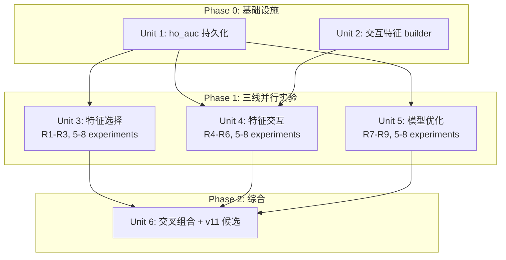

# feat: v10 三线并行模型优化

## Overview

以冠军模型 v10_30d_d3_20260331（5 特征，CV AUC 0.6615，Sharpe 11.98）为基线，从特征选择、特征交互、模型优化三个方向系统搜索可复现的提升。目标 CV AUC ≥ 0.6815 且 Sharpe ≥ 13.98，同时 CV-HO gap ≤ 0.04。

## Problem Frame

v10 仅用 5 个特征，对 taker_vol_raw 高度依赖（SHAP 主效应 0.3604，占 edge ~72%）。特征间交互关系未被显式利用，模型结构固定为 depth=3，未探索更大搜索空间。在现有 CatBoost 生态内，通过三个独立方向系统搜索，找到可复现的综合提升。(see origin: docs/brainstorms/2026-04-01-v10-model-optimization-requirements.md)

## Requirements Trace

- R1. 系统评估增加 3-10 个补充特征的效果
- R2. 候选特征通过单变量 AUC 筛选 + forward selection 验证
- R3. 评估不同特征数量档位（5/8/10/15）对 AUC 和 Sharpe 的影响曲线
- R4. 构建交互特征：乘积、比率、差值、条件组合
- R5. 重点探索 taker_vol × 其他 4 特征的交叉信号
- R6. 评估非线性交互是否优于简单算术交互
- R7. 探索 CatBoost 优化空间：depth 4-6、Logloss vs CrossEntropy、更大 Optuna 搜索
- R8. 评估轻量集成方案（限训练时评估，部署仍用单模型）
- R9. 探索概率校准对 Sharpe 的影响
- R10. 所有实验使用相同 30 天数据窗口和 4-fold purged CV
- R11. 每个实验记录 run_id 到 model_runs 表，附带 tags
- R12. 三线并行执行，最终选取综合最优配置作为 v11 候选
- SC1. CV AUC ≥ 0.6815（+0.02）
- SC2. Sharpe ≥ 13.98（+2）
- SC3. CV-HO gap ≤ 0.04
- SC4. 交易频率不低于 v10 的 80%（≥1700 笔，防止 AUC 升但 PnL 降）

## Scope Boundaries

- 数据范围保持 30 天不变 (see origin)
- 不更换模型框架，聚焦 CatBoost 生态 (see origin)
- 不修改标签定义（±0.03% 阈值不变）(see origin)
- 不修改回测逻辑；特征工程代码（features.py）可扩展 (see origin)
- 每个方向 5-8 个实验，总计 15-24 个实验 (see origin)
- R8 集成仅限训练时评估，不改变部署架构（单 .cbm 文件） (see origin)

## Context & Research

### Relevant Code and Patterns

- `training/train_pipeline.py` — 主训练流程，Optuna 搜索空间在 `optuna_search()` (lines 525-584)
- `data/features.py` — 14 个 builder 函数，`build_features()` 汇总，~700+ 特征列
- `data/feature_metadata.py` — `FEATURE_META` 字典 (~100 entries)，不完整
- `training/train_pipeline.py::FEATURE_CATEGORIES` — 25 个类别定义 (lines 62-109)
- `training/train_pipeline.py::select_features_by_category()` — 3 阶段特征选择
- `training/backtest.py` — 回测逻辑，Sharpe = `mean(pnl) / std(pnl) * sqrt(n_trades)`
- `training/overfit_report.py` — 过拟合阈值: train-CV > 0.05 WARNING, CV-HO > 0.04 WARNING
- `db.py` — model_runs 表 schema，当前无 ho_auc 列
- `cli/cmd_train.py` — `--features-include/exclude`, `--tags`, `--parent`, `--loss-function`

### Institutional Learnings

- **更多特征 ≠ 更好 Sharpe**: 5f→16f 时交易数从 2124 降到 1608，PnL 下降 13%。增加特征时必须同时监控交易频率 (Obsidian: BTC 5min Predictor - 模型训练经验 §11.6-11.7)
- **高 SHAP 交互 ≠ 高 AUC 增益**: 50 个候选中多个 SHAP 交互 > 0.006 但加入后 AUC 下降。必须用 CV AUC 做最终判定 (同上 §11.5)
- **Boruta survivors 必须强制入选**: taker_vol_raw 单特征 AUC +0.12，使其他特征边际贡献低于 min_gain 阈值。Forward Selection 从空集开始会被"淹没" (同上 §11.6)
- **depth 过拟合**: v9 depth=9 → train-CV gap 0.051，每叶 ~10 样本。depth=3 时 gap 降至 0.019。特征数 8+ 时 depth 4-5 可能合理 (v10 MODEL_CARD)
- **30d 窗口信号消失**: Coinbase Premium、ETH 相关、OI、多空比在 30d 上被 Boruta 判定零贡献。不应期望这些类别产出有效特征 (同上 §11.4)
- **PurgedTimeSeriesSplit 不可商量**: purge_gap=12，禁止随机切分 (memory: feedback_no_random_split.md)

## Key Technical Decisions

- **交互特征构建位置**: 在 `data/features.py` 中新增 `_interaction_features()` 函数。注意：与现有 14 个 builder 不同，此函数接受已拼接的特征 DataFrame（非原始 df_1m），必须在 `build_features()` 的 `pd.concat()` 之后、5-min 采样之前调用。理由：交互特征依赖其他 builder 的输出列（如 taker_vol_raw）
- **特征筛选用 FEATURE_CATEGORIES 而非 FEATURE_META**: FEATURE_META 只覆盖 ~100/700+ 特征。FEATURE_CATEGORIES 的 lambda matcher 覆盖所有特征列。R1/R2 的筛选循环应从 categorize_features() 的输出开始
- **ho_auc 持久化**: 新增 model_runs 列 `ho_auc DOUBLE`。训练已计算但丢弃，仅需在 insert_model_run 前赋值。理由：R3/R7 需要 CV-HO gap 精确比较
- **交易频率硬约束**: 所有实验的回测交易数必须 ≥ v10 的 80%（~1700 笔）。理由：历史教训证明 AUC 提升但交易频率下降会导致 Sharpe/PnL 恶化
- **R8 集成限训练时评估**: 多种子训练取 CV 预测平均来评估潜力，不产出可部署 ensemble。理由：当前部署架构用单 .cbm，改动成本与收益不匹配
- **R6 非线性交互与 R7 depth 关系**: 先执行 R7 depth 4-5 实验，如果更深树已捕获交互信号，R6 可降优先级或跳过。理由：CatBoost GBDT 原生能力可能覆盖手工非线性交互

## Open Questions

### Resolved During Planning

- **feature_metadata.py 中有哪些候选特征？** — metadata 仅覆盖 ~100 个，但 features.py 实际产出 ~700+。筛选应从 FEATURE_CATEGORIES 系统开始，结合单变量 AUC 筛选
- **CatBoost 是否原生支持特征交互？** — 不支持。需手动在 features.py 中构建交互列
- **regime-conditional features 如何实现？** — 已有 `regime_` 前缀特征。新增基于波动率分位的条件特征（如 `taker_vol_raw * (vol_5 > vol_5_median)`）
- **多种子集成如何实现？** — 外层循环：for seed in [42, 123, 456] 各训练一次，取 CV 概率平均评估。不修改 train_pipeline 核心流程
- **Platt scaling 是否有边际收益？** — CatBoost Logloss 输出已有一定校准。用 sklearn CalibratedClassifierCV 在 holdout 上实验验证

### Deferred to Implementation

- **单变量 AUC 筛选阈值**: 需要跑一轮 ~700 特征的 AUC 分布后确定 cutoff（预估 > 0.52 有效）
- **交互特征的确切组合数**: taker_vol_raw × 4 个特征 × 4 种运算 = 16 个候选，实际有效数需 forward selection 确认
- **Optuna trials 数**: 当前 80 trials，更大搜索空间可能需要 120-150 trials，需观察收敛速度
- **校准方法选择**: Platt vs isotonic 需实验对比，isotonic 在小样本上可能过拟合

## High-Level Technical Design

> *This illustrates the intended approach and is directional guidance for review, not implementation specification.*

## Implementation Units

### Phase 0: 基础设施准备

- [ ] **Unit 1: ho_auc 持久化到 model_runs**

**Goal:** 训练时计算的 holdout AUC 持久化到 DB，使实验对比能展示绝对 HO AUC（注：CV-HO gap 已通过 overfit_cv_ho_gap 列展示）

**Requirements:** R10, SC3

**Dependencies:** None

**Files:**
- Modify: `training/train_pipeline.py` — 在 run_dict 构建处（lines ~1294-1323）新增 `"ho_auc": _ho_auc`（变量已在 line ~1281 计算，但未加入 run_dict）
- Modify: `db.py` — (1) `_new_model_run_cols` 新增 `ho_auc: DOUBLE`；(2) `insert_model_run()` 的 row dict 新增 `ho_auc` 键
- Modify: `cli/cmd_experiment.py` — `_METRIC_COLS` 新增 `ho_auc` 行
- Test: `tests/test_db_ho_auc.py`

**Approach:**
- `_ho_auc` 在 `holdout_validation()` 后已计算（line ~1281），但 run_dict 内联构建（lines ~1294-1323）未包含此键
- 修复需两处：(1) train_pipeline.py run_dict 新增 `"ho_auc": _ho_auc`；(2) db.py `_new_model_run_cols` + `insert_model_run()` row dict 同步新增
- cmd_experiment.py `_METRIC_COLS` 已有 `overfit_cv_ho_gap`，新增 `ho_auc` 行即可

**Patterns to follow:**
- `db.py` lines 468-485: ALTER TABLE ADD COLUMN IF NOT EXISTS 模式
- `training/train_pipeline.py` line ~1350: run_dict 构建逻辑

**Test scenarios:**
- Happy path: 训练一个模型后查询 model_runs，ho_auc 列非 NULL 且值在 [0.5, 1.0] 范围
- Happy path: `btc experiment compare` 输出包含 ho_auc 和 cv_ho_gap 行
- Edge case: 旧记录（无 ho_auc）在 compare 时显示 N/A 而非报错
- Integration: ALTER TABLE 在已有数据的表上执行不丢失现有行

**Verification:**
- `SELECT ho_auc FROM model_runs WHERE run_id = '<new_run>'` 返回非 NULL 浮点数
- `btc experiment compare <old_id> <new_id>` 正常执行，旧 run 的 ho_auc 显示为 N/A

---

- [ ] **Unit 2: 交互特征 builder**

**Goal:** 在 features.py 中新增 `_interaction_features()` 函数，基于 v10 的 5 个核心特征构建交互列

**Requirements:** R4, R5, R6

**Dependencies:** None (与 Unit 1 并行)

**Files:**
- Modify: `data/features.py` — 新增 `_interaction_features()` 函数，在 `build_features()` 中调用
- Test: `tests/test_interaction_features.py`

**Approach:**
- 与其他 builder 不同，`_interaction_features()` 必须在所有其他 builder 运行后执行，因为它依赖其他 builder 产出的列（如 `taker_vol_raw` 来自 `_futures_features()`）
- 在 `build_features()` 的 concat 之后、采样之前调用，接受已拼接的 DataFrame
- 核心 5 特征: `taker_vol_raw`, `price_vs_rvwap_60`, `cvd_slope_10`, `hour4_sin`, `vpt_sum_30`
- 当 futures 数据不可用时（taker_vol_raw 不存在），跳过所有 taker_vol 相关交互，仅生成其余 4 特征间的交互
- 交互类型:
  - **乘积**: `taker_vol_raw * cvd_slope_10`, `taker_vol_raw * price_vs_rvwap_60`, etc.
  - **比率**: `taker_vol_raw / (vpt_sum_30 + 1e-10)`, etc.
  - **差值**: `taker_vol_raw - cvd_slope_10` (归一化后)
  - **条件**: `taker_vol_raw * (cvd_slope_10 > 0)` (方向性交互)
- 前缀 `ix_` 便于 FEATURE_CATEGORIES 匹配
- 在 `FEATURE_CATEGORIES` (train_pipeline.py) 中新增 `interaction` 类别
- 注意: `hour4_sin` 是周期特征，与连续特征的乘积有意义（时间条件信号）但比率无意义

**Patterns to follow:**
- `data/features.py` 任一现有 builder（如 `_volume_features()`）
- `training/train_pipeline.py` FEATURE_CATEGORIES dict

**Test scenarios:**
- Happy path: `_interaction_features(df)` 返回 DataFrame，列名以 `ix_` 开头，行数与输入一致
- Happy path: taker_vol_raw × cvd_slope_10 乘积值 = 两列逐元素相乘
- Edge case: 输入含 NaN → 交互列对应位置也为 NaN（不引入错误值）
- Edge case: vpt_sum_30 = 0 时比率不产生 inf（除数加 epsilon）
- Integration: `build_features()` 调用后结果包含 `ix_` 前缀列
- Integration: `categorize_features()` 将 `ix_*` 列归入 `interaction` 类别

**Verification:**
- `build_features()` 返回的 DataFrame 包含 ≥12 个 `ix_` 前缀列
- 新类别在 `btc train --features-include interaction` 时正确过滤

---

### Phase 1: 三线并行实验

- [ ] **Unit 3: 特征选择实验 (R1-R3)**

**Goal:** 系统评估增加特征数对 AUC 和 Sharpe 的影响，找到最优特征集

**Requirements:** R1, R2, R3, R10, R11, SC1-SC4

**Dependencies:** Unit 1 (ho_auc 持久化)

**Files:**
- Modify: `training/train_pipeline.py` — 可能需要暴露单变量 AUC 筛选为独立函数
- Create: `experiments/feature_selection_plan.md` — 实验计划和结果记录
- Test: 通过 `btc experiment compare` 验证

**Approach:**

实验序列（5-7 个实验）:

| # | Tag | 描述 | 特征数 |
|---|-----|------|--------|
| FS-1 | `feat_sel_baseline` | v10 重新训练（验证基线可复现） | 5 |
| FS-2 | `feat_sel_screen` | 单变量 AUC 筛选 ~700 特征，产出 Top-N 候选列表 | — |
| FS-3 | `feat_sel_8f` | v10 5f + forward selection 增加 3 个最优特征 | 8 |
| FS-4 | `feat_sel_10f` | v10 5f + forward selection 增加 5 个 | 10 |
| FS-5 | `feat_sel_15f` | v10 5f + forward selection 增加 10 个 | 15 |
| FS-6 | `feat_sel_cat` | 从零开始 category-based selection（不锁定 v10 5f） | auto |
| FS-7 | `feat_sel_best` | 基于 FS-2~6 的最优特征集精调 | best |

关键约束:
- FS-2 筛选: 每个特征单独训练 CatBoost 1-fold，取 AUC > 0.52 的候选
- FS-3~5: 锁定 v10 5f（Boruta survivors），用 forward selection 贪心添加
- 每个实验用 `--parent <v10_run_id>` 自动对比
- 每个实验用 `--tags feat_sel_Xf` 标记
- 回测交易数 ≥ 1700 的硬约束

**注意事项（来自历史教训）:**
- 30d 窗口下 Coinbase/ETH/OI/多空比可能无信号，不应期望这些类别贡献
- 更多特征会降低交易频率，必须同时监控 n_trades
- Boruta survivors 必须强制入选，避免被 taker_vol_raw 淹没

**Test scenarios:**
- Happy path: FS-1 基线复现 — CV AUC 在 0.66 ± 0.01 范围
- Happy path: FS-3 (8f) 的 cv_mean_auc 在 model_runs 表中有值，tags = 'feat_sel_8f'
- Edge case: 某档位（如 15f）交易频率低于 1700 → 记录为 "fails trade frequency constraint"
- Integration: `btc experiment compare <fs1_id> <fs3_id>` 正确展示所有指标 diff

**Verification:**
- model_runs 表中有 5-7 条带 `feat_sel_*` tag 的记录
- 产出特征数 vs AUC/Sharpe 的影响曲线数据
- 最优特征数档位已识别

---

- [ ] **Unit 4: 特征交互实验 (R4-R6)**

**Goal:** 评估交互特征对 AUC 和 Sharpe 的增量贡献

**Requirements:** R4, R5, R6, R10, R11, SC1-SC4

**Dependencies:** Unit 1 (ho_auc), Unit 2 (交互特征 builder)

**Files:**
- 通过 CLI 参数运行实验，无需新增代码文件
- Create: `experiments/feature_interaction_plan.md` — 实验计划和结果记录

**Approach:**

实验序列（5-6 个实验）:

| # | Tag | 描述 |
|---|-----|------|
| FI-1 | `feat_ix_multiply` | v10 5f + 4 个 taker_vol 乘积交互 |
| FI-2 | `feat_ix_ratio` | v10 5f + 4 个 taker_vol 比率交互 |
| FI-3 | `feat_ix_all_arith` | v10 5f + 全部算术交互（~16 列） |
| FI-4 | `feat_ix_conditional` | v10 5f + 条件交互（方向性） |
| FI-5 | `feat_ix_best_arith` | v10 5f + FI-1~4 中 AUC 增益 > 0 的交互子集 |
| FI-6 | `feat_ix_nonlinear` | v10 5f + 最佳算术交互 + regime-conditional（**Phase 2 执行**，仅当 MO-1/2 depth 实验未覆盖交互信号时） |

关键约束:
- 所有实验锁定 depth=3（与 v10 一致），隔离交互特征的贡献
- 用 CV AUC 增益做最终判定，不用 SHAP 交互值
- FI-6 条件执行：如果 Unit 5 中 depth 4-5 已捕获交互信号，FI-6 可跳过

**Test scenarios:**
- Happy path: FI-1 的 `--features-include` 正确包含 `ix_taker_vol_mul_*` 列
- Happy path: FI-3 (全部交互) 的特征数 = 5 + ~16 = ~21，model_runs 中 n_features 对应
- Edge case: 某交互特征全为 NaN（如 vpt_sum_30 长期为 0）→ 特征选择自动排除
- Integration: `btc experiment compare <v10_id> <fi5_id>` 显示交互特征的增量贡献

**Verification:**
- model_runs 表中有 5-6 条带 `feat_ix_*` tag 的记录
- 明确结论：哪类交互（乘积/比率/条件）提供了可靠的 AUC 增益

---

- [ ] **Unit 5: 模型优化实验 (R7-R9)**

**Goal:** 探索 CatBoost 超参、集成、概率校准对性能的影响

**Requirements:** R7, R8, R9, R10, R11, SC1-SC4

**Dependencies:** Unit 1 (ho_auc)

**Files:**
- Create: `training/ensemble_eval.py` — 多种子训练 + 预测平均的评估脚本
- Create: `training/calibration_eval.py` — 概率校准实验脚本
- Create: `experiments/model_optimization_plan.md` — 实验计划和结果记录
- Test: `tests/test_ensemble_eval.py`, `tests/test_calibration_eval.py`

**Approach:**

实验序列（6-8 个实验）:

| # | Tag | 描述 |
|---|-----|------|
| MO-1 | `model_depth4` | depth=4, v10 5f |
| MO-2 | `model_depth5` | depth=5, v10 5f |
| MO-3 | `model_depth4_8f` | depth=4, Unit 3 最优 8f 特征集（**Phase 2 执行**，依赖 U3 结果） |
| MO-4 | `model_crossent` | CrossEntropy loss, v10 5f, depth=3 |
| MO-5 | `model_optuna150` | 150 Optuna trials（扩大搜索空间），v10 5f |
| MO-6 | `model_ensemble3` | 3 种子集成评估（seed=42,123,456），v10 5f |
| MO-7 | `model_platt` | Platt scaling on best model from MO-1~5 |
| MO-8 | `model_isotonic` | Isotonic regression on same model |

R8 集成评估方法:
- 分别用 seed=42, 123, 456 训练 3 个模型
- 取 3 个模型的 CV 概率预测平均
- 用平均概率重新计算 AUC、Sharpe（不改变 backtest.py）
- 仅评估潜力，不产出可部署 ensemble

R9 校准方法:
- 使用 CV 预测进行校准评估（避免 holdout 上拟合+评估的 in-sample 偏差）
- 方法: 在每个 CV fold 内部，用 train split 拟合 CalibratedClassifierCV，在 test split 上产出校准后概率
- 用校准后的 out-of-fold 概率重跑 backtest，对比 Sharpe 变化
- Platt scaling（2 参数）在小 fold 上可行；isotonic 需 ≥500 样本/fold，否则跳过

**注意事项:**
- MO-1/MO-2: 5 特征 + depth 4-5 可能仍然过拟合，必须检查 train-CV gap < 0.05
- MO-3 依赖 Unit 3 结果（最优 8f 特征集），可后执行
- MO-6 的 3 次训练共享同一数据和特征，仅种子不同

**Test scenarios:**
- Happy path: `ensemble_eval.py` 接受 3 个 run_id，输出平均 AUC 和 Sharpe
- Happy path: `calibration_eval.py` 接受 1 个 run_id + holdout data，输出校准前后 Sharpe 对比
- Edge case: ensemble 中某个种子的模型 AUC 异常低 → 报告 warning 但仍计算平均
- Edge case: isotonic calibration 在 <500 样本 holdout 上 → 报告 "insufficient samples for isotonic"
- Error path: run_id 不存在 → 清晰报错
- Integration: ensemble 评估结果可通过 `btc experiment compare` 查看（记录为独立 run）

**Verification:**
- model_runs 表中有 6-8 条带 `model_*` tag 的记录
- depth 4-5 的 train-CV gap 数据明确
- 集成和校准的增量效果量化

---

### Phase 2: 综合评估

- [ ] **Unit 6: 交叉组合验证 + v11 候选选择**

**Goal:** 将三条线的最优结果交叉组合，选出 v11 候选

**Requirements:** R12, SC1-SC4

**Dependencies:** Units 3, 4, 5

**Files:**
- Create: `experiments/v11_candidate_selection.md` — 组合实验记录
- 通过 CLI 参数运行 2-3 个组合实验

**Approach:**

1. 汇总三条线结果:
   - 特征选择线: 最优特征数和特征集
   - 特征交互线: 有效交互子集
   - 模型优化线: 最优超参/loss/calibration

2. 组合实验（2-3 个）:

| # | Tag | 描述 |
|---|-----|------|
| V11-1 | `v11_combo1` | 最优特征集 + 最佳交互 + depth=3 |
| V11-2 | `v11_combo2` | 最优特征集 + 最佳交互 + 最优 depth |
| V11-3 | `v11_combo3` | 最优组合 + 校准（如果 R9 有增益） |

3. 最终评估:
   - CV AUC ≥ 0.6815?
   - Sharpe ≥ 13.98?
   - CV-HO gap ≤ 0.04?
   - 交易频率 ≥ 1700?
   - 四项全部满足 → promote 为 v11
   - 部分满足 → 记录结论，评估是否需要扩大数据窗口

**Test scenarios:**
- Happy path: V11-1 综合实验的 tags 正确标记，model_runs 有完整记录
- Happy path: 最终候选通过所有 4 项 success criteria
- Edge case: 无组合达标 → 文档记录每个方向的最大增益和瓶颈分析
- Integration: `btc deploy promote <v11_run_id>` 成功切换活跃模型

**Verification:**
- 明确的 v11 候选 run_id，或"三线均未达标"的量化结论
- 如果达标：`btc deploy promote` 成功，config.py 更新，VPS 同步

## System-Wide Impact

- **Interaction graph:** features.py 新增 builder → build_features() 自动包含 → train_pipeline 特征选择处理 → 回测自动使用
- **Error propagation:** 交互特征中的 NaN/Inf 会被 CatBoost 自动处理（native NaN support），不影响训练流程
- **State lifecycle risks:** ho_auc ALTER TABLE 在已有数据上执行安全（新列默认 NULL）。旧 run 不受影响
- **API surface parity:** `btc experiment compare/list` 的输出格式需兼容新增列，旧数据显示 N/A
- **Integration coverage:** 新交互特征必须通过 `build_features()` → `get_feature_columns()` → `categorize_features()` 全链路
- **Unchanged invariants:** 回测逻辑 (backtest.py) 不变、标签生成 (labels.py) 不变、部署架构 (单 .cbm) 不变、live service 不变

## Risks & Dependencies

| Risk | Mitigation |
|------|------------|
| 30d 数据量（6634 样本）可能不足以支持 15 特征 | R3 影响曲线会暴露过拟合点；交易频率硬约束兜底 |
| Sharpe = mean/std × √n_trades，交易数下降会机械性降低 Sharpe（1700 vs 2124 → -10.6%），SC2 隐含要求 per-trade edge 提升 ~24% | 所有实验同时监控交易数和 per-trade Sharpe（mean/std），不仅看总 Sharpe |
| 三线实验总量（15-24 个）的多重比较假阳性 | 要求 AUC 和 Sharpe 同时达标 + CV-HO gap 约束，三重门槛降低假阳性风险 |
| depth 4-5 在 5 特征上可能过拟合 | overfit_report.py 的 train-CV gap > 0.05 阈值自动告警 |
| 交互特征增加维度但信息可能已被树模型隐式捕获 | FI-6 条件执行；先看 R7 depth 实验结果 |
| ensemble_eval.py / calibration_eval.py 为新代码 | 仅用于评估，不改变生产流程。测试覆盖核心路径 |

## Sources & References

- **Origin document:** [docs/brainstorms/2026-04-01-v10-model-optimization-requirements.md](docs/brainstorms/2026-04-01-v10-model-optimization-requirements.md)
- Related plan: [docs/plans/2026-03-31-001-feat-ml-iteration-cli-plan.md](docs/plans/2026-03-31-001-feat-ml-iteration-cli-plan.md) (已完成的 CLI 基础设施)
- v10 MODEL_CARD: `models/v10_30d_d3_20260331/MODEL_CARD.md`
- 训练经验: `BTC 5min Predictor - 模型训练经验.md` (Obsidian)
- 特征工程: `BTC 5min Predictor - Feature Engineering.md` (Obsidian)
